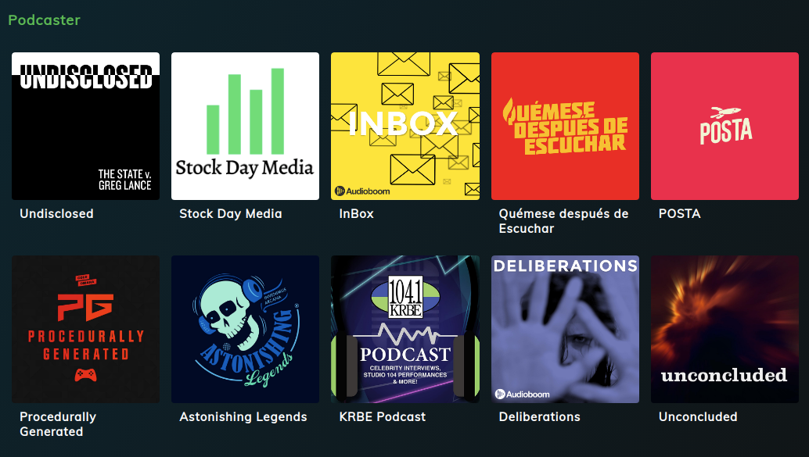

# Podcaster

## ⚡️ Quick start

1. Clone or fork the repository:

- `git clone git@github.com:rubbenpad/podcaster.git`

2. Navigate into your new folder and install dependencies 🔍

- `cd podcaster && yarn install`

3. Development ⛏

- `yarn dev`

4. Production 🔥

- `yarn build && yarn start`

License MIT
